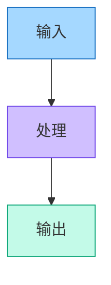
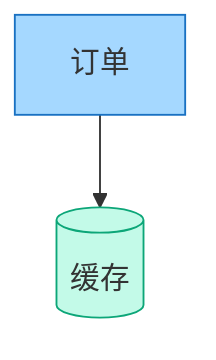
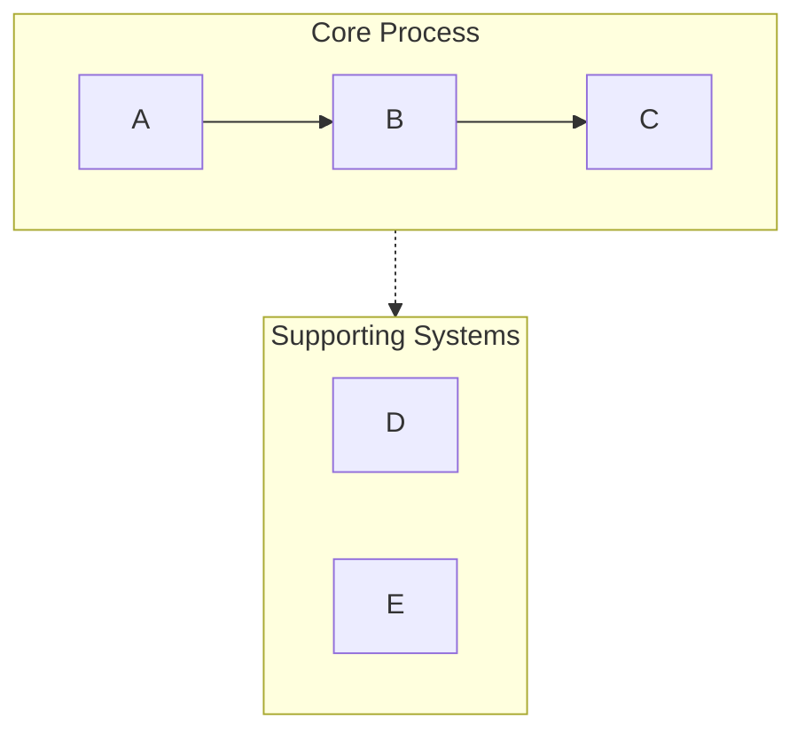
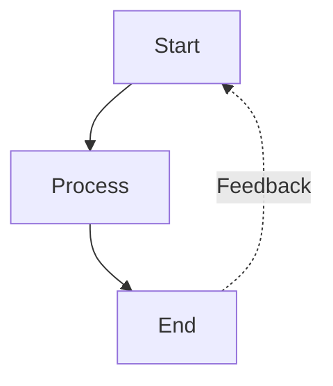
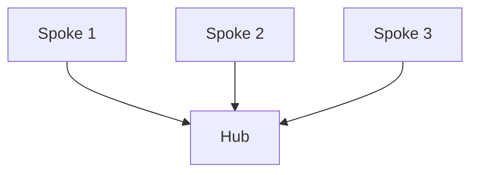

# Mermaid Backend

Text → Mermaid code fence. Renders in Obsidian, GitHub, and most Markdown viewers. Read this after [SKILL.md](../SKILL.md) has already picked the backend and the diagram type.

**Defaults:** vertical (`TB`) layout · standard detail · semantic colors · Obsidian/GitHub-compatible syntax.

---

## Diagram type → Mermaid construct

### 1. Process flow — `graph TB` / `graph LR`

Workflows, decision trees, sequential processes, agent architectures.

- Swimlanes via `subgraph`
- Arrow labels for transitions
- Feedback loops and branches
- Color-coded stages

### 2. Circular flow — `graph TD` with a feedback edge

Cyclic processes, continuous-improvement loops, agent feedback systems. Central hub + radiating elements, curved feedback arrows.

### 3. Comparison — `graph TB` with parallel paths

Before/after, A vs B, traditional vs modern. Side-by-side columns, optional central comparison node, contrasting fills.

### 4. Mindmap — `mindmap`

Hierarchical concepts, topic breakdowns. Radial tree, multiple nesting levels.

### 5. Sequence — `sequenceDiagram`

Component interactions, API calls, message flows. Timeline layout, clear actor separation, activation boxes.

### 6. State — `stateDiagram-v2`

System states, status transitions, lifecycle stages. State nodes, labeled transitions, explicit start/end.

---

## Critical syntax rules

These five prevent nearly every parse failure seen in practice.

### Rule 1 — Avoid list-syntax conflicts

```
❌ WRONG: [1. Perception]       → 触发 "Unsupported markdown: list"
✅ RIGHT: [1.Perception]         → 去掉句点后的空格
✅ RIGHT: [① Perception]         → 圈码数字 ①②③④⑤⑥⑦⑧⑨⑩
✅ RIGHT: [(1) Perception]       → 用括号
✅ RIGHT: [Step 1: Perception]   → 用 Step 前缀
```

### Rule 2 — Subgraph naming

```
❌ WRONG: subgraph AI Agent Core          → 名字带空格且未加引号
✅ RIGHT: subgraph agent["AI Agent Core"] → ID + 显示名
✅ RIGHT: subgraph agent                  → 只用简单 ID
```

### Rule 3 — Node references

```
❌ WRONG: Title --> AI Agent Core  → 引用显示名
✅ RIGHT: Title --> agent          → 引用 subgraph ID
```

### Rule 4 — Special characters in node text

```
✅ 带空格的文本加引号：["Text with spaces"]
✅ 双引号 → 『』
✅ 圆括号 → 「」
✅ 换行只在圆形节点内可靠：((Text<br/>Break))
```

### Rule 5 — Arrow types

| 写法 | 含义 |
|------|------|
| `-->` | 实线箭头 |
| `-.->` | 虚线箭头（支撑系统、可选路径） |
| `==>` | 粗箭头（强调） |
| `~~~` | 隐形连线（仅用于布局） |

完整语法参考与排错：[mermaid-syntax.md](mermaid-syntax.md)

---

## Configuration options

**Layout**
- `direction`: vertical (`TB`) · horizontal (`LR`) · right-to-left (`RL`) · bottom-to-top (`BT`)
- `aspect`: portrait（默认）· landscape · square

**Detail level**
- `simple` — 只保留核心元素
- `standard` — 关键描述齐全（默认）
- `detailed` — 完整注解与元数据
- `presentation` — 为幻灯片优化：字大、信息少

**Style**
- `minimal` — 单色、干净线条
- `professional` — 语义色 + 清晰层次（默认）
- `colorful` — 高饱和高对比
- `academic` — 论文/文档的正式风格

**Extras:** `show_legend` · `numbered`（步骤编号）· `title`

---

## Applying the palette

Use SKILL.md 的语义色板，Mermaid 侧用 `style` 或 `classDef` 落地。浅填充配深描边：



复用同一语义时用 `classDef`：



---

## Common patterns

### Swimlane（分组）



### Feedback loop



### Hub and spoke



---

## Output

Wrap in a ` ```mermaid ` fence, write it into the target document, then add a one-paragraph explanation of the structure and offer variations.

---

## Mermaid checklist

- [ ] 节点文本中无 "数字. 空格" 模式
- [ ] 所有 subgraph 用 `id["显示名"]` 写法
- [ ] 所有连线引用 ID 而非显示名
- [ ] 箭头语法正确（`-->` / `-.->` / `==>`）
- [ ] 指定了布局方向
- [ ] `style` / `classDef` 声明齐全，配色语义一致
- [ ] 无 Emoji
- [ ] 双引号已换 `『』`、圆括号已换 `「」`
- [ ] 在 Obsidian / GitHub 渲染器下可解析
