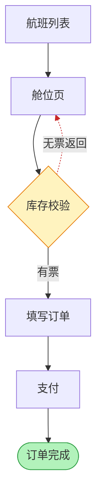

# PRD Flow → Diagram

PRD 里用自然语言写的业务流程 → 图。这是一条**入口路径**，不是第四个后端：先把流程文字抽成图结构，再交给 Mermaid 或 Excalidraw 渲染。

读完本文后回到 [references/mermaid.md](mermaid.md) 或 [references/excalidraw.md](excalidraw.md) 完成渲染。

---

## When to use

适用：

- PRD 已用自然语言描述了流程 ——「用户从航班列表进入舱位页，选择舱位后进入填写订单页，完成支付后生成订单」
- 想自动生成流程图而不是手画
- 流程图需要长期维护（跟着 PRD 一起改）

不适用：

- 对话里临时画个简单 ASCII 流程
- 输入不是清晰的步骤或状态转换描述

---

## Step 1 — 抽取图结构

从流程文字里提出 `nodes` / `edges` / `layoutHints`：

```json
{
  "nodes": [
    {"id": "start",  "label": "航班列表",  "kind": "step"},
    {"id": "cabin",  "label": "舱位页",    "kind": "step"},
    {"id": "check",  "label": "库存校验",  "kind": "decision"},
    {"id": "order",  "label": "填写订单",  "kind": "step"},
    {"id": "pay",    "label": "支付",      "kind": "step"},
    {"id": "done",   "label": "订单完成",  "kind": "state"}
  ],
  "edges": [
    {"source": "start", "target": "cabin", "type": "normal"},
    {"source": "cabin", "target": "check", "type": "normal"},
    {"source": "check", "target": "order", "type": "success", "label": "有票"},
    {"source": "check", "target": "cabin", "type": "fail",    "label": "无票返回"},
    {"source": "order", "target": "pay",   "type": "normal"},
    {"source": "pay",   "target": "done",  "type": "success"}
  ],
  "layoutHints": {
    "direction": "TB",
    "layers": [["start"], ["cabin"], ["check"], ["order"], ["pay"], ["done"]]
  }
}
```

**抽取规则：**

1. **切分步骤** —— 按「→」「->」「然后」「接着」「之后」「完成后」切开
2. **每步一个 node** —— `id` 用简短英文/拼音，`label` 用中文原词（保持与 PRD 正文一致，便于对照）
3. **判定 `kind`**：

   | kind | 语义 | 文字特征 |
   |------|------|---------|
   | `step` | 页面 / 操作步骤 | 「进入…页」「填写…」「点击…」 |
   | `decision` | 判定分支点 | 「若…则…」「校验」「判断」「是否」 |
   | `state` | 终态 / 系统状态 | 「订单完成」「已出票」「失败」 |

4. **顺序相邻两步连一条 `normal` 边**
5. **条件分支** —— 「若校验失败则返回舱位页」这类，生成 `decision` 节点 + 两条边，`type` 分别为 `success` / `fail`，并在 `label` 上写清条件
6. **布局提示** —— 未指定时默认 `TB`；按步骤顺序把节点分层放进 `layers`，同层可放多个节点（分支并列）

**中间 JSON 存不存？** 流程简单（≤10 节点、一次性）时直接在内存里走完、不落盘。流程复杂或要反复调整时，用 Write 存到 `ai-output/temporary/data/prd-flow-graph-{主题}-{YYYYMMDD}.json`，改图时改 JSON 重渲染，不用重新读 PRD。

---

## Step 2 — 选后端

| 情况 | 后端 |
|------|------|
| 图要**嵌进 PRD 正文**（绝大多数情况） | **Mermaid** —— 跟 PRD 一起 diff、一起评审，改流程就改几行文字 |
| 图要**单独交付**（评审配图、汇报材料），或节点带复杂视觉分层 | **Excalidraw** |

PRD 场景默认 Mermaid。选 Excalidraw 前先确认用户确实要一个独立文件。

---

## Step 3a — 渲染成 Mermaid

`kind` 决定节点形状，`edge.type` 决定箭头与配色：

| 元素 | 写法 |
|------|------|
| `kind: step` | `id[标签]` |
| `kind: decision` | `id{标签}` |
| `kind: state` | `id([标签])` |
| `type: normal` | `-->` |
| `type: success` | `-->` + 绿色 `linkStyle` |
| `type: fail` | `-.->` + 红色 `linkStyle` |
| 边带 `label` | `-->|标签|` |

`layoutHints.direction` 直接落成 `graph TB` / `graph LR`；`layers` 交给 Mermaid 自动布局即可，不必手工干预。

上例渲染结果：



节点文字里的括号/引号按 [SKILL.md](../SKILL.md) 的规则换成 `「」` / `『』`。

---

## Step 3b — 渲染成 Excalidraw

`layers` 直接映射成坐标网格：

- `direction: TB` —— 每层一行，层间 Y 步进 **100px**；同层节点水平排开，间距 **40px**，整层居中于画布中轴
- `direction: LR` —— 每层一列，层间 X 步进 **240px**；同层节点垂直排开，间距 **30px**
- 节点框 **170×60**（`kind: decision` 用 `b.box` 配黄色填充；Excalidraw 没有菱形语义框，靠颜色区分）

节点配色沿用 SKILL.md 语义色板：

| kind / type | 填充 | 描边 |
|-------------|------|------|
| `step` | `#a5d8ff` | `#1971c2` |
| `decision` | `#fff3bf` | `#e67700` |
| `state` | `#b2f2bb` | `#2f9e44` |
| 边 `success` | — | `#2f9e44` |
| 边 `fail` | — | `#c92a2a`，`stroke_style="dashed"` |

节点数 ≥15 时按 [excalidraw.md](excalidraw.md) 的规定走 `ExcalidrawBuilder` 脚本，逐层循环生成，不要手写 JSON。

---

## Step 4 — 落地到 PRD

**Mermaid** —— 直接把 fence 写进 PRD 对应章节，不产生额外文件。

**Excalidraw** —— 存到 `Excalidraw/<主题>/<流程名>.excalidraw.md`（按业务主题建子目录，禁止平铺到 `Excalidraw/` 根目录），然后在 PRD 中嵌入：

```markdown
![[Excalidraw/国际机票/下单流程.excalidraw.md]]
```

> 旧的 `prd-flow-graph-from-text` 技能要求把流程图存到 `ai-output/formal/`，与本仓库「Excalidraw 一律进 `Excalidraw/<主题>/`」的约定冲突。**以 `Excalidraw/<主题>/` 为准。**

---

## Checklist

- [ ] 节点 `label` 与 PRD 正文用词一致（评审时能对上）
- [ ] 条件分支的两条出边都有 `label` 写明条件
- [ ] `kind` 判定正确：判定点是 `decision` 不是 `step`
- [ ] 终态节点用 `state`，视觉上与中间步骤可区分
- [ ] 后端选择正确：嵌进 PRD → Mermaid
- [ ] Excalidraw 产物存在 `Excalidraw/<主题>/`，不在 `ai-output/`
- [ ] PRD 正文改流程后，图同步更新
